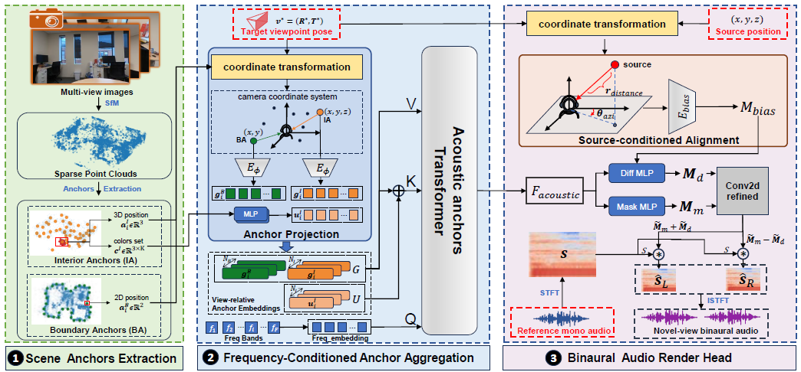

# S2A-NVAS (Novel-View Acoustic Synthesis from Sparse Point Clouds via Structured Interior–Boundary Anchors)

This repository contains the official implementation of **S2A-NVAS**.

## Overview

**S2A-NVAS** tackles **novel-view binaural audio synthesis** by replacing dense, appearance-heavy scene priors with **lightweight SfM sparse point clouds** that can be reconstructed quickly. We convert raw SfM geometry into **structured sparse visual priors** through two complementary anchor types:

- **Interior anchors**: summarize **local 3D structure** that shapes near-field interactions and early reflections.  
- **Boundary anchors**: capture the **global scene layout** that governs long-range propagation and reverberation.

As shown in the overview figure, **S2A-NVAS** is organized into three modules:

1. **Scene Anchors Extraction**: extracts interior and boundary anchors from the SfM point cloud as stable, propagation-aligned priors.  
2. **Frequency-Conditioned Anchor Aggregation**: projects and aggregates anchors at the **target viewpoint** via **frequency-conditioned attention** to produce acoustic features for binaural prediction.  
3. **Binaural Audio Rendering Head**: applies the predicted binaural masks to the reference mono spectrogram and synthesizes binaural audio via iSTFT.

Given a **mono source signal** and a **target listener pose**, S2A-NVAS predicts **binaural audio** at the target view efficiently and robustly, without dense scene reconstruction.



---

## Requirements

We verified the code with the following computational environment:

- **OS**: Ubuntu 20.04.2 LTS  
- **GPU**: GeForce RTX 3090 Ti (24GB VRAM)  
- **Python**: 3.9.10  

Key dependencies (see `requirements.txt` for the full list):

- `torch==2.0.1`  
- `torchaudio==2.0.2`  
- `librosa==0.11.0`  
- `scipy==1.15.3`  
- `numpy==1.26.4`  

### Install

```bash
pip install -r requirements.txt
```

## Data and Preprocessing

### 1) Download RWAVS

Download the **RWAVS** dataset (publicly available) from Hugging Face Datasets:
- https://huggingface.co/datasets/susanliang/RWAVS

After downloading, place the dataset under `data_RWAVS/` with the following structure:

```bash
./data_RWAVS/
├── 1
│   ├── binaural_syn_re.wav
│   ├── feats_train.pkl
│   ├── feats_val.pkl
│   ├── frames
│   │   ├── 00001.png
│   │   ├── ...
│   │   └── 00616.png
│   ├── source_syn_re.wav
│   ├── transforms_scale_train.json
│   ├── transforms_scale_val.json
│   ├── transforms_train.json
│   └── transforms_val.json
├── ...
├── 13
└── position.json
```

### 2) SfM Reconstruction (Fixed Pose)

To reconstruct an SfM sparse point cloud aligned to the **same world coordinate system as the training poses**( `colmap` needs to be installed),   run :

```bash
cd sfm_reconstruct_fixedpose
bash run_fixedpose.sh
```

This step will generate a scene-level sparse point cloud (`points3D.ply`) under each scene directory.

### 3) Anchor Extraction

Next, extract the **boundary anchors** and **interior anchors**:

```bash
cd locate_anchors
python boundary_point_extraction.py
python interior_point_extraction.py
```

After preprocessing, each scene directory will contain three additional files:

```bash
./data_RWAVS/
├── 1
│   ├── points3D.ply                 # reconstructed sparse point cloud (SfM)
│   ├── 256_interior_points          # extracted interior anchors
│   ├── 32_boundary_points           # extracted boundary/wall anchors
├── ...
├── 13
└── position.json
```

## Quick Start

### Training

You can train the model scene-by-scene using the default configuration:

```bash
bash run_train.sh
```

------

### Evaluation

After training, run evaluation on the target scenes:

```bash
bash test.sh
```

The evaluation script reports metrics per scene and can optionally export predicted binaural audio.

Average metrics for 13 scenes of RWAVS

```bash
python compute_metrics_avg.py --log-dir[]
```

------

## Notes

- Please finish **SfM reconstruction** and **anchor extraction** before training.
- `points3D.ply`, `256_interior_points`, and `32_boundary_points` are required inputs for S2A-NVAS.
-  core code (`model.py`) will be released upon acceptance.

